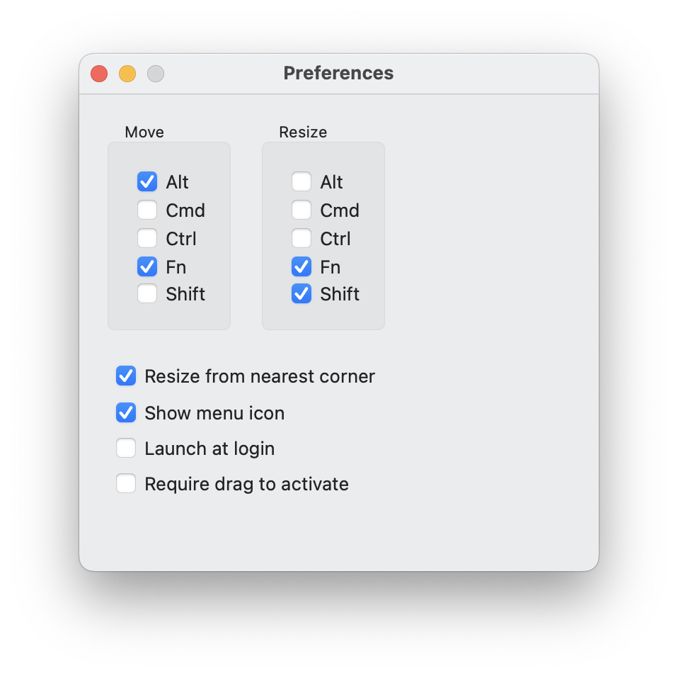

<p align="center">
  
</p>

<h1 align="center">Appresize</h1>

Resize & move apps from anywhere on the window with custom modifiers.



## Releases

I have not elected to sign the app by joining the Apple Developer Program. The releases have been self-signed by me and can be installed by bypassing the typical app security on macOS. You're also welcome to build and bundle the app yourself with Xcode. For a signed release, consider installing the [upstream fork release](https://github.com/finestructure/Hummingbird).

To build, run the release task from `Taskfile.dist.yaml`.

```sh
task build:release
```

Open the app `build/Build/Products/Release/Appresize.app`. 

> [!IMPORTANT]  
> With a new build, you'll have to quit the previously built app, remove and re-add the app entry in MacOS settings Privacy & Security > Accessibility.

## Known Limitations

This app uses the macOS Accessibility APIs in order to discover windows and update their position and size. Some apps such as Telegram and Stream Deck create windows that don't participate in this mechanism and are invisible to this software.

## Contributing

Contributions are welcome. Credit to Easy Move+Resize by Daniel Marcotte and Hummingbird by Sven A. Schmidt for their original work.
